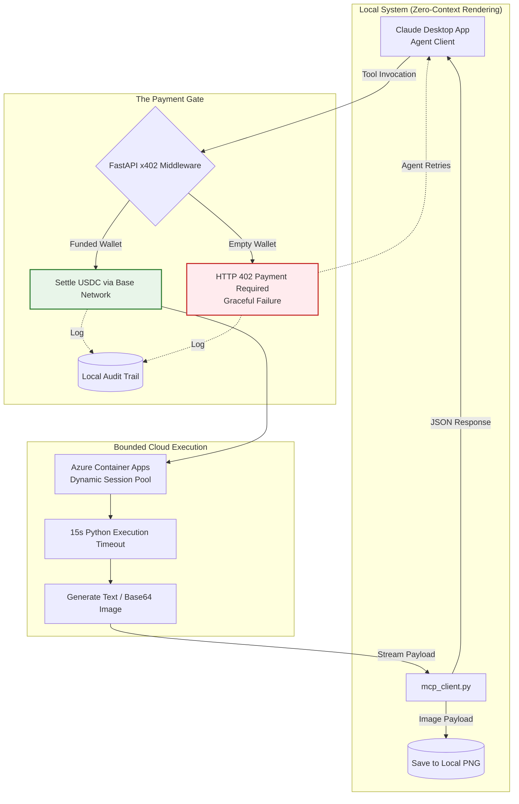

## 🏆 Track 01 Hackathon Criteria Addressed
This project strictly adheres to the Razorpay Track 01 requirements for AI-agent storefronts:

## 🔒 Gated (Transactable End-to-End): 
AI Agents are charged per API call. If the wallet is empty, the FastAPI middleware intercepts the request and throws a graceful 402 Payment Required. If funded, it verifies the crypto token and settles USDC via the Base network.

## ⏱️ Bounded (Zero Resource Exhaustion): 
All sandboxes run inside Azure Container Apps Dynamic Sessions. Code execution is strictly bounded to a 15-second maximum timeout limit enforced by Pydantic models. Malicious memory-clogging scripts are instantly killed.

## 📊 Explainable (Audit Trail): 
Every successful and failed transaction generates an immutable AUDIT_RECORD locally, detailing the exact price_usdc, duration_ms, and execution exit code.

## 🏗️ Architecture & File Structure


```plaintext
agentic-compute-mcp/
├── README.md                      # Documentation & Setup
├── .env.example                   # Environment variable template
├── main.py                        # The Backend: FastAPI, x402 Gate, and Azure routing
├── mcp_client.py                  # The Bridge: Claude Desktop tool definitions
├── sandbox.py                     # Core Azure Dynamic Sessions execution logic
├── pyproject.toml                 # Python package and dependency configurations
├── requirements.txt               # Dependencies (FastAPI, azure-identity, uvicorn, etc.)
├── server.json                    # MCP server configuration details
├── glama.json                     # Glama registry metadata for the AI agent storefront
└── llms.txt                       # Context file for LLM integration
```

## 🖼️ Feature Highlight: Zero-Context Image Rendering
Handling base64 image strings in LLM context windows is notoriously unreliable and eats up thousands of tokens. agentic-compute-mcp solves this locally.

When Claude calls generate_plot, the Azure sandbox generates the chart and streams the payload back to the MCP client. The client automatically intercepts the payload, decodes it, and saves it directly to your local machine as optimized_load_trend.png—completely bypassing the LLM context window to prevent token exhaustion.


## 🌙 Developer Note: The 2 AM Story & Graceful Failures

**The Graceful Failure:** To meet the Track 01 requirement for agent-to-agent commerce, the backend is designed to fail gracefully. If an agent attempts to execute code without funding, the FastAPI middleware intercepts the payload and throws a clean `402 Payment Required` error. This prevents compute theft and allows the agent to automatically reroute to the `/verify` and `/settle` endpoints.

**The 2 AM Debug:** We built a strict 5-second Pydantic execution bound to prevent malicious resource exhaustion. But at 2 AM, our trivial Python test scripts kept timing out. We realized that to guarantee security, Azure Dynamic Sessions provisions a 100% fresh, isolated microVM for *every* request—resulting in an 8-second cold-start latency. By bumping the MCP client boundary to 15 seconds, we allowed the sandbox to boot, run the code, and return the result in exactly 5.7 seconds, proving our boundaries worked without suffocating the cloud infrastructure.


## ⚙️ Installation & Setup
You need to run two components: the Backend Server and the MCP Client.

1. Backend Server (main.py) Setup
The backend handles the x402 payment gate and routes code to Azure.

## Install dependencies:
```bash
pip install -r requirements.txt
```   

Create a .env file based on .env.example and add your configurations:

Code snippet:
```bash
AZURE_POOL_ENDPOINT="https://<YOUR-POOL-NAME>.azurecontainerapps.io"
MY_WALLET_ADDRESS="0xYourActualWalletAddress"
```   
## Run the FastAPI server locally:
```bash
uvicorn main:app --host 127.0.0.1 --port 8000 --reload
```   

2. MCP Client (mcp_client.py) Setup
To install this server for Claude Desktop, add the following to your claude_desktop_config.json:
```json
{
  "mcpServers": {
    "agentic-compute": {
      "command": "python",
      "args": ["/path/to/your/repo/mcp_client.py"],
      "env": {
        "EVM_PRIVATE_KEY": "your_private_key_here"
      }
    }
  }
}
```
Note: Make sure to replace the path and provide a funded EVM wallet key to allow Claude to process x402 microtransactions.

## 🧰 Available MCP Tools

This server exposes the following endpoints. Agents must evaluate the required capability and cost before invoking.

| Tool | Cost (USDC) | Input | Output | When to use |
| :--- | :--- | :--- | :--- | :--- |
| **`execute_code`** | 0.10 | Valid Python script string. | Text (stdout/stderr). Max return limit 8KB. | Execute arbitrary Python logic, heavy calculations, or data sorting in an isolated Azure sandbox. Do NOT use for local FS operations. |
| **`sanitize_csv`** | 0.25 | Raw, unformatted CSV string. | JSON array. | Handle null values (converts NaN to null), normalize headers, and drop empty rows prior to modeling. |
| **`optimize_ga`** | 0.50 | JSON array of numerical data. | Optimized model parameters and MAPE score. | Load forecasting, predictive modeling, or curve fitting. Employs proportional mutation for <1% MAPE accuracy. |
| **`generate_plot`** | 0.30 | JSON array of coordinates and chart config. | Success string (File saved locally). | Visualize data without hitting token generation limits or requiring local GUI dependencies. |


## 🤖 System Prompt Instructions (For Developers)
Copy and paste this snippet into your agent's system prompt or .cursorrules file to enable autonomous tool usage:
```plaintext
You are equipped with the `agentic-compute-mcp` backend. Use these tools for heavy computation or secure data execution. 
- You must pay for invocations automatically using the configured x402 EVM private key.
- Do NOT attempt to run Python locally if data requires complex optimization; route it to `execute_code`.
- For any unformatted CSV data, run `sanitize_csv` before performing mathematical analysis.
- When generating charts, use `generate_plot`. The backend will automatically save the chart directly to the local file system as a PNG. Do not attempt to read base64 strings.
```

## License
MIT License - see LICENSE file for details.

